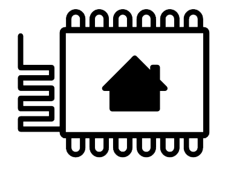
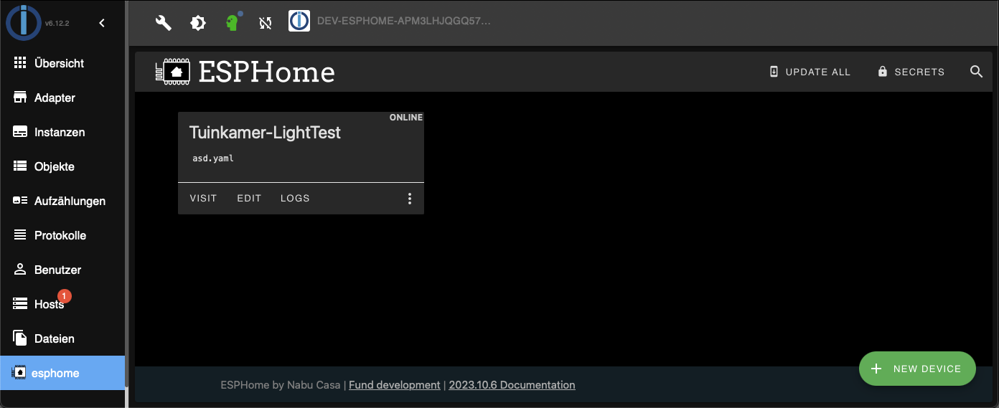

# ioBroker.esphome

[](https://www.npmjs.com/package/iobroker.esphome)
[](https://www.npmjs.com/package/iobroker.esphome)


[](https://david-dm.org/DrozmotiX/iobroker.esphome)
[](https://weblate.iobroker.net/engage/adapters/?utm_source=widget)
[](https://snyk.io/test/github/DrozmotiX/ioBroker.esphome)

[](https://nodei.co/npm/iobroker.esphome/)

**Tests:** 

**This adapter uses Sentry libraries to automatically report exceptions and code errors to the developers.** For more details and for information how to disable the error reporting see [Sentry-Plugin Documentation](https://github.com/ioBroker/plugin-sentry#plugin-sentry)! Sentry reporting is used starting with js-controller 3.0.

## ESPHome adapter for ioBroker

Control your ESP8266/ESP32 with simple yet powerful configuration files created and managed by ESPHome.
Native integration of ESPHome managed device (Including Dashboard) by its native API and ensure all data is synchronised (live-event handling, no data polling ! :)



This adapter uses the [esphome-native-api](https://github.com/Nafaya/esphome-native-api#readme) with all credits to @Nafaya to interact with [ESPHome API](https://esphome.io/components/api.html?highlight=api)!

## [Documentation](https://DrozmotiX.github.io/languages/en/Adapter/ESPHome/)

All our adapter documentation can be found at [The DrozmotiX Docu Page](https://DrozmotiX.github.io/languages/en/Adapter/ESPHome/)

## Prerequisites

    * NodeJS >= 18.x
    * API is activated in YAML
    * For admin tabs (optional)
        * ESPHome Dashboard IP is provided in instance settings

### Activate API in YAML

```
api:
  password: 'MyPassword'
```


### Example config
Example config, for more examples see [The DrozmotiX Docu Page](https://DrozmotiX.github.io) or [ESPHome Documentation](https://esphome.io/index.html)

<details><summary>Show example config
</summary>

    esphome:
      name: sensor_badkamer
      platform: ESP32
      board: esp-wrover-kit
    
    wifi:
      use_address: 192.168.10.122
      ssid: "xxxxx"
      password: "xxxxxx"
              
    # Enable ESPHome API
    api:
        password: 'MyPassword'
    # Activate i2c bus  
    i2c:
      sda: 21
      scl: 22
      scan: True
      id: bus_a
      
    # Example configuration for bh1750
    sensor:
      - platform: bh1750
        name: "Hal_Illuminance"
        address: 0x23
        measurement_time: 69
        update_interval: 10s
        
    # Example configuration for an GPIO output    
    output:
      - platform: gpio
        pin: 12
        inverted: true
        id: gpio_12
        
    # Example configuration linking a switch to the previous defined output
    switch:
      - platform: output
        name: "Generic Output"
        output: 'gpio_12'
</details>

## Tasmota / ESPEasy migration

Migrating from previous Sonoff Tasmota or ESPEasy setups is very easy. You just need to have ESPHome create a binary for you and then upload that in the web interface.  
See for more details our [Docu Page](https://DrozmotiX.github.io/languages/en/Adapter/ESPHome/06.migration.html)

**_NOTE:_** Generated yaml files are stored at ```/opt/iobroker/iobroker-data/iobroker.esphome.>instance</>device<.yaml


## Support me
If you like my work, please consider a personal donation  
(this is an personal Donate link for DutchmanNL, no relation to the ioBroker Project !)  
[](http://paypal.me/DutchmanNL)

## Changelog

<!--
    Placeholder for the next version (at the beginning of the line):
    ### __WORK IN PROGRESS__
    * (DutchmanNL) 
-->

### __WORK IN PROGRESS__
* (DutchmanNL) cleanup unused channels & states after initialisation of device, fixes #39

### 0.3.2 (2023-11-01)
* (DutchmanNL) Improved error handling if devices are not reachable/disconnected
* (DutchmanNL) Bugfix: Allow control of brightness and color for light component, fixes #173

### 0.3.1 (2023-10-31)
* (DutchmanNL) Bugfix: Show online state of ESP Device correctly, Fixes #106

### 0.3.0 (2023-10-31) - Bugfixes & Improvements
* (Dutchman & SimonFischer04) Several Bugfixes
* (SimonFischer04) Support type "select device"
* (DutchmanNL) ESPHome dashboard default disabled
* (SimonFischer04) Migrate to @2colors/esphome-native-api
* (DutchmanNL) Automatically create needed directories, Fixes #168
* (SimonFischer04) Migrate usage of python to new structure, should solve all ESPHome Dashboard related installation issues

### 0.2.4 (2021-08-24)
* (DutchmanNL) Version of ESPHome Dashboard updated to 2021.8
* (DutchmanNL) Add option if config of ESPHome device should be shown as states (default = FALSE, safes 8 states for each sensor)

### 0.2.3 (2021-06-29)
* (Jey-Cee) Bugfix : Light component state not changed [#74](https://github.com/DrozmotiX/ioBroker.esphome/issues/74)
* (DutchmanNL) Update compatibility to version 1.19.4 of ESPHome Dashboard

## License
MIT License

Copyright (c) 2023 DutchmanNL <rdrozda86@gmail.com>

Permission is hereby granted, free of charge, to any person obtaining a copy
of this software and associated documentation files (the "Software"), to deal
in the Software without restriction, including without limitation the rights
to use, copy, modify, merge, publish, distribute, sublicense, and/or sell
copies of the Software, and to permit persons to whom the Software is
furnished to do so, subject to the following conditions:

The above copyright notice and this permission notice shall be included in all
copies or substantial portions of the Software.

THE SOFTWARE IS PROVIDED "AS IS", WITHOUT WARRANTY OF ANY KIND, EXPRESS OR
IMPLIED, INCLUDING BUT NOT LIMITED TO THE WARRANTIES OF MERCHANTABILITY,
FITNESS FOR A PARTICULAR PURPOSE AND NONINFRINGEMENT. IN NO EVENT SHALL THE
AUTHORS OR COPYRIGHT HOLDERS BE LIABLE FOR ANY CLAIM, DAMAGES OR OTHER
LIABILITY, WHETHER IN AN ACTION OF CONTRACT, TORT OR OTHERWISE, ARISING FROM,
OUT OF OR IN CONNECTION WITH THE SOFTWARE OR THE USE OR OTHER DEALINGS IN THE
SOFTWARE.