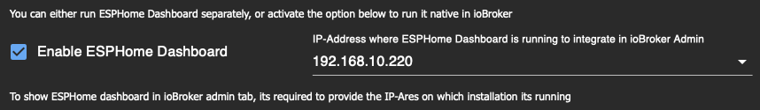
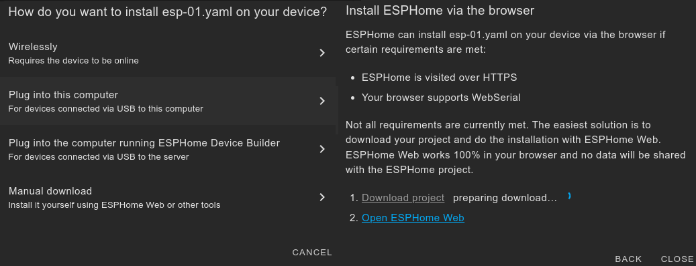
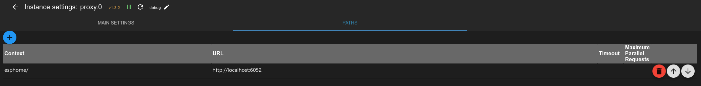
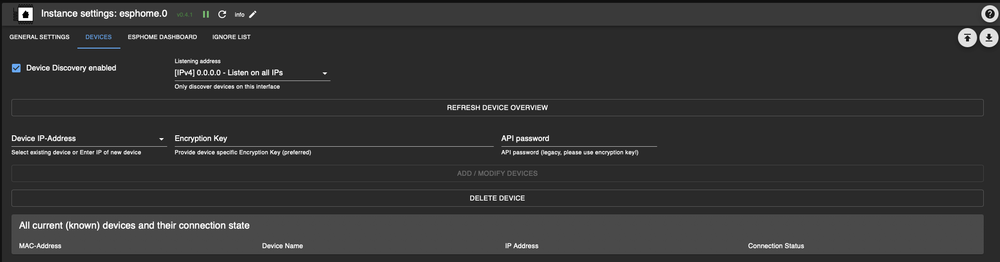
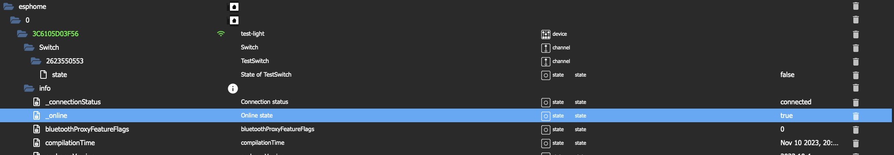

# ioBroker.esphome

[](https://www.npmjs.com/package/iobroker.esphome)
[](https://www.npmjs.com/package/iobroker.esphome)


[](https://david-dm.org/DrozmotiX/iobroker.esphome)
[](https://weblate.iobroker.net/engage/adapters/?utm_source=widget)
[](https://snyk.io/test/github/DrozmotiX/ioBroker.esphome)

[](https://nodei.co/npm/iobroker.esphome/)

**Tests:** 

**This adapter uses Sentry libraries to automatically report exceptions and code errors to the developers.** For more details and for information how to disable the error reporting see [Sentry-Plugin Documentation](https://github.com/ioBroker/plugin-sentry#plugin-sentry)! Sentry reporting is used starting with js-controller 3.0.

## ESPHome adapter for ioBroker

Control your ESP8266/ESP32 with simple yet powerful configuration files created and managed by ESPHome.
Native integration of ESPHome managed device (Including Dashboard) by its native API and ensures all data is synchronized (live-event handling, no data polling ! :)


**Quick Links:**
- 📋 [FAQ - Common Questions](#frequently-asked-questions-faq)
- ⚙️ [Prerequisites & Setup](#prerequisites)
- 🎛️ [Dashboard Integration](#esphome-dashboard-integration-optional)
- 📱 [Device Management](#device-management)
- 🔧 [Configuration Examples](#example-config)

This adapter uses the [esphome-native-api](https://github.com/twocolors/esphome-native-api#readme) with all credits to @twocolors to interact with [ESPHome API](https://esphome.io/components/api.html?highlight=api)!

## Frequently Asked Questions (FAQ)

### What's the difference between the ioBroker ESPHome Adapter and ESPHome Dashboard?

**ioBroker ESPHome Adapter:**
- Integrates your ESPHome devices into ioBroker for home automation control
- Communicates directly with ESP devices via ESPHome's native API
- Creates ioBroker states/objects for device control and monitoring
- Handles real-time device status updates (no polling required)
- Manages device configuration within ioBroker

**ESPHome Dashboard:**
- A web interface for creating, editing, and managing ESPHome device configurations
- Used for writing YAML configs, compiling firmware, and flashing devices
- Can be integrated into ioBroker's admin interface as an optional feature
- Can be run either integrated with this adapter or as an external installation (Docker, standalone)

**In Summary:** The adapter controls your devices within ioBroker, while the dashboard manages device configurations and firmware.

### How do I configure the Dashboard IP selector?

The Dashboard IP setting in the adapter configuration serves different purposes:

**For Integrated Dashboard Tab in ioBroker Admin:**
1. Enter the IP address and port where your ESPHome Dashboard is running
2. **Built-in Dashboard:** Use the IP address of your ioBroker host (e.g., `192.168.1.10:6052`)
    - **Important:** Do NOT use `127.0.0.1:6052` (nor `localhost:6052`) if you access ioBroker from other devices - the iframe will try to reach 127.0.0.1 from the client's browser, not the ioBroker server
   - Only use `127.0.0.1:6052` if you ONLY access ioBroker admin from the same machine where ioBroker is running
3. **External Dashboard:** Use the IP:port of your external ESPHome installation (e.g., `192.168.1.100:6052`)
4. **HTTPS Setup:** For HTTPS environments, see the detailed HTTPS configuration section below

**Dashboard IP Examples:**
- Built-in (accessed from network): `192.168.1.10:6052` (replace with your ioBroker host IP)
- Built-in (local only): `127.0.0.1:6052` (only if admin accessed on same machine)
- External Host: `esphome.local:6052` or `192.168.1.100:6052`
- HTTPS Proxy: `https://192.168.1.50:8082/proxy.0/esphome/`



**Note:** You can use this adapter to control ESPHome devices without configuring the Dashboard IP. The Dashboard IP is only needed if you want to integrate the ESPHome Dashboard interface into ioBroker's admin panel.

### Do I need the ESPHome Dashboard to use this adapter?

**No, the Dashboard is optional.** You can use this adapter in several ways:

1. **Adapter Only:** Control pre-configured ESPHome devices without any dashboard integration
2. **Adapter + External Dashboard:** Use your existing ESPHome installation (Docker, standalone) and optionally integrate it into ioBroker's interface
3. **Adapter + Built-in Dashboard:** Enable the integrated ESPHome Dashboard feature for a complete solution

The adapter works independently and only requires devices with ESPHome API enabled in their configuration.

### How do I add devices to the adapter?

1. **Ensure ESPHome API is enabled** in your device's YAML configuration (see Prerequisites section)
2. **Open the adapter's device tab** in ioBroker Admin (adapter must be running)
3. **Add devices manually:** Enter device IP address and authentication credentials
4. **Automatic discovery:** Use the autodiscovery feature if enabled in adapter settings

The adapter will establish a connection and create all necessary ioBroker objects for device control.

### I configured a device in the ESPHome Dashboard, but it doesn't show up in the adapter

**Important:** The adapter and dashboard are completely separate components with no automatic integration. The adapter can optionally install (and start) the dashboard for you, just for convenience. Again, this does not mean there is any integration between them.

- **Dashboard:** Used for creating/editing YAML configs, compiling firmware, and flashing devices
- **Adapter:** Used for controlling devices and synchronizing their state with ioBroker

**To make a dashboard-configured device work with the adapter:**
1. Flash the device with the configuration from the dashboard (ensure ESPHome API is enabled in YAML)
2. Manually add the device in the adapter settings (device tab). Enter IP/hostname and encryption key (recommended) or password (legacy)
3. The adapter will then connect to the device via ESPHome's native API

**Note:** Future tighter integration between dashboard and adapter may be implemented (see issue #228), but currently they operate independently.

### I configured a device in the adapter, but it doesn't show up in the dashboard

**This is expected behavior** - the adapter and dashboard do not automatically sync device configurations.

- The **adapter** connects to devices via ESPHome's native API for control/monitoring
- The **dashboard** manages YAML configurations and firmware compilation

**If you want the device in the dashboard:**

**Option 1:**
1. The ESPHome Dashboard can discover devices in the same network automatically
2. In the dashboard, discovered devices will show with an "ADOPT" button
3. Click "ADOPT" to add them to your dashboard for configuration management

**Option 2:**
- Create a new device in the dashboard and copy your existing yaml into there.

**Note:** You don't need devices in the dashboard if you only want to control them via ioBroker. The dashboard is only needed for creating/modifying device configurations.

### How do I install / update Python

TLDR: You don't!

The adapter does not care about your system's python installation. It will install and create its own python environment with the correct versions anyway. So please don't mess around with python commands on your system if you don't know what you are doing.

<!--
## [Documentation](https://DrozmotiX.github.io/languages/en/Adapter/ESPHome/)

All our adapter documentation can be found at [The DrozmotiX Docu Page](https://DrozmotiX.github.io/languages/en/Adapter/ESPHome/) 
-->

## Prerequisites

    * NodeJS >= 20.x
    * API is activated in YAML
    * For admin tabs (optional)
        * ESPHome Dashboard IP is provided in instance settings

## ESPHome Dashboard Integration (Optional)

This adapter can optionally integrate the ESPHome Dashboard into ioBroker's admin interface. You have several options:

**Option 1: Built-in Dashboard (Recommended for beginners)**
- Enable "Native Integration of ESPHome Dashboard" in adapter settings
- Uses integrated Python environment (no external setup required)
- Dashboard runs on port 6052 by default
- Set Dashboard IP to `127.0.0.1:6052` for admin integration

**Option 2: External Dashboard**
- Use existing ESPHome installation (Docker, standalone, etc.)
- Enter the external dashboard's IP:port in adapter settings
- Example: `192.168.1.100:6052` for Docker container

**Option 3: No Dashboard Integration**
- Skip dashboard configuration entirely
- Use external ESPHome tools for device configuration
- Adapter still controls devices normally


> **💡 See FAQ above** for detailed explanations about Dashboard IP configuration and adapter vs. dashboard differences.

### Using HTTPS

One reason to use HTTPS is to be able to flash directly to devices plugged into you pc, because esphome will not allow this with http (probably browser limitation with WebSerial).



Using the integrated dashboard when the iobroker is using https currently requires some more steps:

1. install - if you don't have it already - web adapter and configure https. see web documentation for further information: [ioBroker.web](https://github.com/ioBroker/ioBroker.web)
2. install [proxy](https://github.com/ioBroker/ioBroker.proxy) adapter
3. configure the path in the proxy adapter settings:
   1. context: `esphome/`
   2. url: `http://localhost:6052`

4. configure the full dashboard url in the advanced section of the esphome adapter settings - esphome dashboard:
   1. like: `https://<iobrokerIP>:<webAdapterPort>/proxy.0/esphome/`
   2. where `<iobrokerIP>` is the ip of the host where you iobroker is running (same as above)
   3. and `<webAdapterPort>` is the port of the web adapter (default is 8082)
   4. it should look something like this:
   
   5. if you run the dashboard on an external host, you can also use the url to an external dashboard instance here

## How to use this adapter

### Activate API in YAML
> [!IMPORTANT]
> ioBroker ESPHome allows to integrate Devices by Encryption Key (recommended) or API-Password (legacy), 
> you must specify your authentication settings accordingly, 
> see [ESPHome Documentation](https://esphome.io/components/api.html?highlight=api)
> Please only configure Encryption Key (preferable) or API-Password (legacy)

#### Example Encryption Key configuration entry
```
api:
  encryption:
    key: "DyDfEgDzmA9GlK6ZuLkj3qgFcjXiZUzUf4chnIcjQto="
```

#### Example API configuration entry
```
api:
  password: 'MyPassword'
```

## Device Management

### Add / Modify / Remove ESPHome devices to ioBroker
> [!IMPORTANT]
> This adapter integrates communication with ESPHome capable devices and 
> (if activated) an integrated version of ESPHome Dashboard.
> You must configure and upload your ESP configuration by yourself, 
> either by using the integrated Dashboard or an external alternative 
> (like Docker) before they can be integrated to ioBroker

> **💡 See FAQ above** for step-by-step guidance on adding devices to the adapter.

The device Tab will show all current known devices; you can either wait for Devices to be autodetect
(currently disabled, see #175) or add them manually by providing their IP-Address and credentials



> [!NOTE]
> Buttons to add/modify/remove devices and load device table are only available if adapter is running!
> You must refresh the device table manually by pressing "Refresh device Overview", all devices and their connection state will be shown

Please enter IP-Address (if a device is already known, you can select it from the dropdown) and choose the proper actions:
- ADD / Modify Devices
  - Will send IP address and credentials to the backend and try to establish a connection
  - When an encryption Key is provided, API-Password is ignored, please ensure proper YAML configuration!

- Delete Device
  - Will send a message to the backend to remove this device

> [!WARNING]
> This action will remove a selected device and all its related states from ioBroker!

> [!NOTE]
> After a device has been added, a message will be indicated if successfully or error, 
> you can refresh the table to show current devices and their connection status


If connection was successfully, the Device will be initiated and all related states created to control their attributes.  
When making any changes to your YAML configuration, reboot of the ESP will disconnect and initiate a new connection.  
During this process, states not part anymore of YAML configuration will be automatically removed.



### YAML File Management

The adapter provides a convenient interface for managing YAML configuration files directly from the admin UI. This feature allows you to upload, download, and manage YAML files that are stored in the ESPHome directory and can be used by the ESPHome Dashboard.

#### Features

- **Upload YAML Files**: Paste your YAML configuration content directly into the admin interface and upload it to the ESPHome directory
- **View File List**: See all YAML files currently stored in the ESPHome directory with file size and modification date
- **Download Files**: Retrieve the content of any YAML file for editing or backup
- **Delete Files**: Remove YAML files that are no longer needed

#### How to Use

1. **Navigate to the "YAML Files" tab** in the adapter configuration
2. **Upload a new file**:
   - Enter a filename (must end with .yaml or .yml)
   - Paste your YAML configuration content
   - Click "Upload File"
3. **Refresh the file list** to see all available YAML files
4. **Download or delete files**:
   - Enter the filename in the "Select file" field
   - Click "Download File" to view the content or "Delete File" to remove it

> [!NOTE]
> Files are stored in the ESPHome directory: `/opt/iobroker/iobroker-data/esphome.<instance>/`
> 
> This is the same directory used by the ESPHome Dashboard, so files uploaded through the adapter
> are immediately available in the Dashboard and vice versa.

> [!TIP]
> This feature is particularly useful when:
> - You want to quickly edit configurations without accessing the server file system
> - You need to backup or share device configurations
> - You want to manage YAML files without running the full ESPHome Dashboard

### Example config
Example config, for more examples see [The DrozmotiX Docu Page](https://DrozmotiX.github.io) or [ESPHome Documentation](https://esphome.io/index.html)

<details><summary>Show example config
</summary>

    esphome:
      name: sensor_badkamer
      platform: ESP32
      board: esp-wrover-kit
    
    wifi:
      use_address: 192.168.10.122
      ssid: "xxxxx"
      password: "xxxxxx"
              
    # Enable ESPHome API
    api:
        password: 'MyPassword'
    # Activate i2c bus  
    i2c:
      sda: 21
      scl: 22
      scan: True
      id: bus_a
      
    # Example configuration for bh1750
    sensor:
      - platform: bh1750
        name: "Hal_Illuminance"
        address: 0x23
        measurement_time: 69
        update_interval: 10s
        
    # Example configuration for an GPIO output    
    output:
      - platform: gpio
        pin: 12
        inverted: true
        id: gpio_12
        
    # Example configuration linking a switch to the previous defined output
    switch:
      - platform: output
        name: "Generic Output"
        output: 'gpio_12'
</details>

## Controlling RGBW Lights

### RGB vs RGBW — What's the Difference?

**RGB lights** use three channels (red, green, blue) to produce colours, including white by mixing all three at maximum. **RGBW lights** add a dedicated fourth white channel (`white`) that provides a cleaner, brighter white than mixing RGB.

### Available states for a light entity

| State | Description |
|---|---|
| `colorHEX` | Writable hex colour string, e.g. `#ff6600`. Writing here updates red/green/blue and sends the command. |
| `red` / `green` / `blue` | Individual colour channels (0 – 255). |
| `white` | Dedicated white channel (0 – 255). Only present on RGBW-capable lights. |
| `brightness` | Overall brightness (0 – 255). |
| `config.rgbAutoWhite` | **RGBW only** — when set to `true`, writing `#ffffff` to `colorHEX` automatically activates the white channel and sets RGB to zero. Writing any other colour disables the white channel and uses RGB. |

### Auto white-channel switching (`rgbAutoWhite`)

When an RGBW-capable light is detected (i.e. it exposes a `white` state), the adapter automatically creates a writable `config.rgbAutoWhite` toggle state for that entity. It defaults to `false` (disabled).

**To enable:**
1. Open the ioBroker **Objects** view and navigate to your light entity, e.g. `esphome.0.MyLight.Light.1.config.rgbAutoWhite`.
2. Set the value to `true`.

**Behaviour when enabled:**

| `colorHEX` input | Result |
|---|---|
| `#ffffff` | `white` → 1 (full), `red` / `green` / `blue` → 0 |
| Any other colour | `white` → 0, RGB channels set to the colour values |

**Behaviour when disabled (default):** the `white` channel is never touched automatically; users control it independently.

## Tasmota / ESPEasy migration

Migrating from previous Sonoff Tasmota or ESPEasy setups is very easy. You just need to have ESPHome create a binary for you and then upload that in the web interface.  
See for more details on our [Docu Page](https://DrozmotiX.github.io/languages/en/Adapter/ESPHome/06.migration.html)

**_NOTE:_** Generated yaml files are stored at ```/opt/iobroker/iobroker-data/iobroker.esphome.>instance</>device<.yaml


## Support me
If you like my work, please consider a personal donation  
(this is a personal Donate link for DutchmanNL, no relation to the ioBroker Project !)  
[](http://paypal.me/DutchmanNL)

## Changelog

<!--
    Placeholder for the next version (at the beginning of the line):
    ### __WORK IN PROGRESS__
    * (DutchmanNL) 
-->
### 0.7.0-beta.4 (2026-02-21)
* (DutchmanNL) **FIXED**: ESLint errors by code refactoring
* (@copilot) **FIXED**: Restore missing `configStates` option in admin UI to allow configuring whether configuration states are shown per entity
* (@copilot) **NEW**: Per-device `rgbAutoWhite` toggle in the light config channel for automatic white-channel routing on RGBW lights (see [Controlling RGBW Lights](#controlling-rgbw-lights))

### 0.7.0-beta.3 (2026-02-20)
* (@copilot) **NEW**: Added support for `colorBrightness`, `coldWhite`, `warmWhite`, and `colorMode` states for lights using the new ESPHome color mode API
* (@copilot) **FIXED**: RGB light control (brightness, color, white, colorTemperature) not working with newer ESPHome firmware that uses `supportedColorModesList` instead of deprecated legacy flags (#338)

### 0.7.0-beta.2 (2026-02-20) - add capability for fans & Lock entity
* (@SimonFischer04) improve README
* (@SimonFischer04) fix #394, actually fix #340, #356
* (DutchmanNL) **FIXED**: Fan component not working #205
* (@copilot) **NEW**: Allow customization of Pillow version used by ESPHome Dashboard, similar to ESPHome version selector
* (@copilot) **NEW**: Add "Clear Autopy Cache" button in ESPHome Dashboard configuration tab to resolve dashboard loading issues (#209)

### 0.7.0-beta.1 (2026-02-16) - Add support for Lock entity & improve dashboard testing
* (@copilot) **NEW**: Add support for Lock entity type - Lock devices now properly display state and control options #353
* (@copilot) **NEW**: YAML file management interface in admin UI for upload/download/delete operations (#369)
* (@SimonFischer04) improve dashboard testing
* (@SimonFischer04) improve logging for #201
* (@SimonFischer04) update pillow
* (@SimonFischer04) fix readme link to lib
* (@SimonFischer04) fix connection status #311
* (@SimonFischer04) remove unneeded node-fetch dependency
* (@SimonFischer04) automatic migration from versions prior to ESPHomeDashboardUrl introduction (pre v0.6.1)
* (@copilot) **FIXED**: Invalid jsonConfig schema - removed unsupported `doNotSave` property from table elements

### 0.6.3 (2025-09-16)
* (@DutchmanNL) Fixed an admin error related to `jsonConfig` validation. #287
* (@DutchmanNL) Various general fixes and dependency updates to improve stability.
* (@DutchmanNL) Improved responsive design for better usability across devices. #284
* (@DutchmanNL) Introduced GitHub Actions to automatically verify the ESPHome Dashboard. #290
* (@DutchmanNL) Added a comprehensive FAQ section to the README to help users with common questions. #286
* (@DutchmanNL) Updated the `esphome-native-api` library to V1.3.3, which may resolve connection issues. #201

## License
MIT License

Copyright (c) 2023-2026 DutchmanNL <rdrozda86@gmail.com>

Permission is hereby granted, free of charge, to any person obtaining a copy
of this software and associated documentation files (the "Software"), to deal
in the Software without restriction, including without limitation the rights
to use, copy, modify, merge, publish, distribute, sublicense, and/or sell
copies of the Software, and to permit persons to whom the Software is
furnished to do so, subject to the following conditions:

The above copyright notice and this permission notice shall be included in all
copies or substantial portions of the Software.

THE SOFTWARE IS PROVIDED "AS IS", WITHOUT WARRANTY OF ANY KIND, EXPRESS OR
IMPLIED, INCLUDING BUT NOT LIMITED TO THE WARRANTIES OF MERCHANTABILITY,
FITNESS FOR A PARTICULAR PURPOSE AND NONINFRINGEMENT. IN NO EVENT SHALL THE
AUTHORS OR COPYRIGHT HOLDERS BE LIABLE FOR ANY CLAIM, DAMAGES OR OTHER
LIABILITY, WHETHER IN AN ACTION OF CONTRACT, TORT OR OTHERWISE, ARISING FROM,
OUT OF OR IN CONNECTION WITH THE SOFTWARE OR THE USE OR OTHER DEALINGS IN THE
SOFTWARE.
